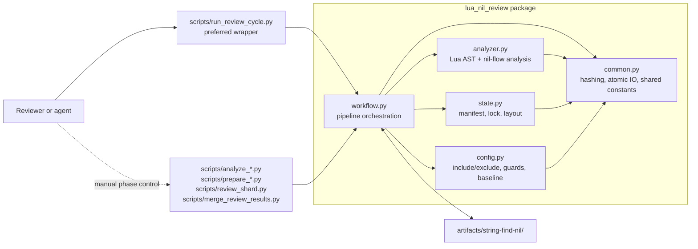
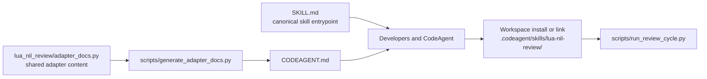
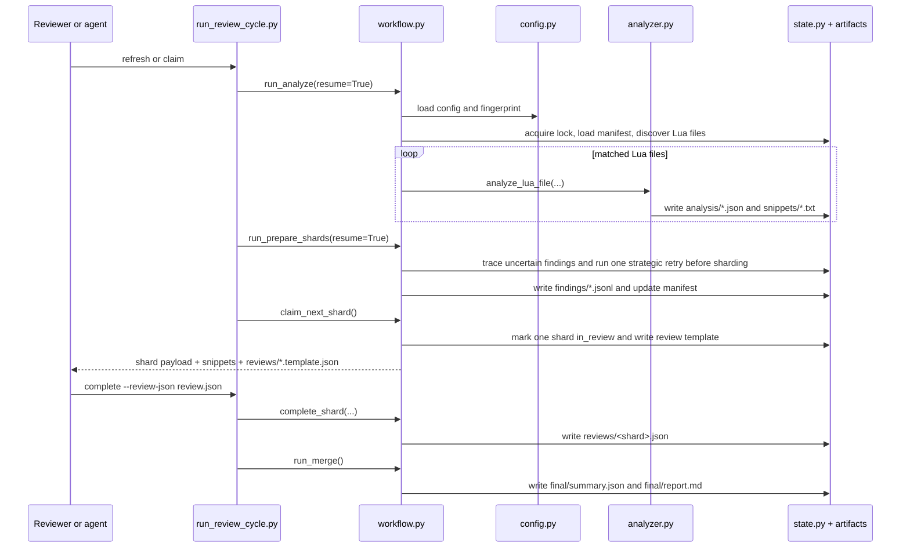
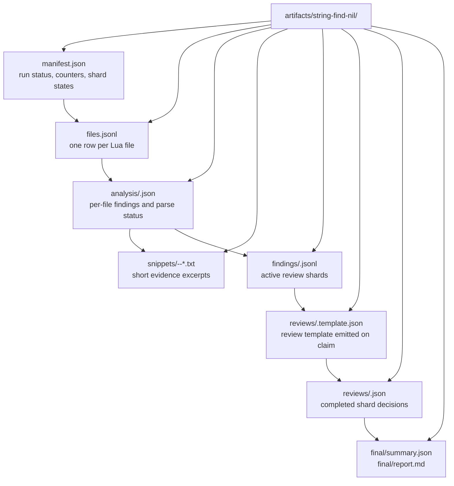

# Architecture Overview

This repository is easiest to understand through three complementary diagrams:

- a runtime map for "who calls what"
- a review-cycle sequence for "what happens in one operator session"
- an artifact map for "what persists across sessions"

Mermaid is used instead of a static image so the diagrams stay editable, diff-friendly, and close to the code.

## 1. Runtime Architecture

### How to read this

- `scripts/run_review_cycle.py` is the shortest path for agents and humans. It stitches `analyze -> prepare -> claim` or `complete -> merge`.
- The same wrapper also exposes `status`, and `refresh/claim --progress` stream manifest-backed progress for large repositories.
- The lower-level `scripts/*.py` files are thin entrypoints for manual phase control. They all end up in `lua_nil_review.workflow`.
- `workflow.py` is the real state machine. It decides when to reuse old analysis, shard findings, reclaim stale review work, and merge outputs.
- `analyzer.py` is intentionally narrow: it parses Lua, tracks local nil-state, discovers `string.find` sinks across expression contexts, and emits short snippets instead of forcing full-file review.
- `prepare` is where most of the agentic behavior happens now: initial trace, caller/callee follow-up, strategic retry for uncertain findings, and frontier `jump` expansion all happen before a shard is exposed to review.
- `state.py` owns the persisted layout and lock discipline so long reviews can resume safely.

## 2. Skill and Adapter Surfaces

### What this means

- `SKILL.md` is the repo-native explanation of the capability and workflow.
- `CODEAGENT.md` is the generated adapter doc, not a hand-maintained copy.
- The same runtime scripts are reused whether the skill is linked into another workspace or run from this repository directly.

## 3. Review Cycle

### Important behavior hidden inside the sequence

- `claim` is not just "claim". The wrapper refreshes analysis and shard preparation first, then claims exactly one shard.
- The refresh path is agentic, not passive. Before a human or CodeAgent reviewer sees a shard, the workflow already tries a second deeper trace pass on uncertain findings and attaches extra jump evidence when possible.
- Visible findings now carry direct investigation artifacts, including `candidate_summary`, `scenario_branches`, and `why_still_uncertain`, so the agent does not need to reconstruct candidate context from raw trace graphs first.
- Resume behavior is content-hash based. Unchanged Lua files reuse prior analysis.
- Snippets are first-class review inputs. The workflow is designed to avoid opening giant Lua files unless evidence is insufficient.
- Review work is fault-tolerant. Shards stuck in `in_review` are reclaimed when their heartbeat is stale.

## 4. Persisted Artifact Map

### Why the artifact layout matters

- `manifest.json` is the control tower. It tracks stage, counters, and shard ownership.
- `manifest.json -> prepare_progress` is the live sub-structure to watch when `shards_total` is still `0` during a large run.
- `files.jsonl` is the incremental cache index. It tells the analyzer which file results can be reused.
- `analysis/` is the durable machine output for each Lua file.
- `findings/` contains only active review work, which keeps the reviewer's working set small.
- `reviews/` stores human or agent decisions separately from raw findings so merge can be rerun safely.
- `final/` is derived output. It can be regenerated from the review artifacts.

## Module Cheat Sheet

| Path | Role |
| --- | --- |
| `scripts/run_review_cycle.py` | Preferred high-level wrapper for normal use. |
| `scripts/analyze_string_find_nil.py` | Runs the analysis phase only. |
| `scripts/prepare_review_shards.py` | Builds review shards from active findings. |
| `scripts/review_shard.py` | Claims, heartbeats, and completes a shard. |
| `scripts/merge_review_results.py` | Produces final JSON and Markdown reports. |
| `lua_nil_review/workflow.py` | Orchestrates the persisted review state machine. |
| `lua_nil_review/analyzer.py` | Parses Lua and computes nil-risk findings plus snippet evidence. |
| `lua_nil_review/state.py` | Builds the artifact layout, manifest, and locking behavior. |
| `lua_nil_review/config.py` | Loads `.lua-nil-review.json` and defines the analysis fingerprint. |
| `lua_nil_review/adapter_docs.py` | Defines shared content for generated adapter docs. |
| `tests/test_pipeline.py` | End-to-end regression coverage for pipeline behavior and wrapper flow. |

## Recommended Reading Order

1. Start with [codeagent_getting_started.md](codeagent_getting_started.md) if you are new and want the shortest path to a working setup.
2. Read this file for the pictures and terminology.
3. Read [workflow.md](workflow.md) for the persisted state rules.
4. Read [configuration.md](configuration.md) for config keys, wrapper usage, and review JSON shape.
5. Open `workflow.py` and `analyzer.py` if you need implementation detail.
